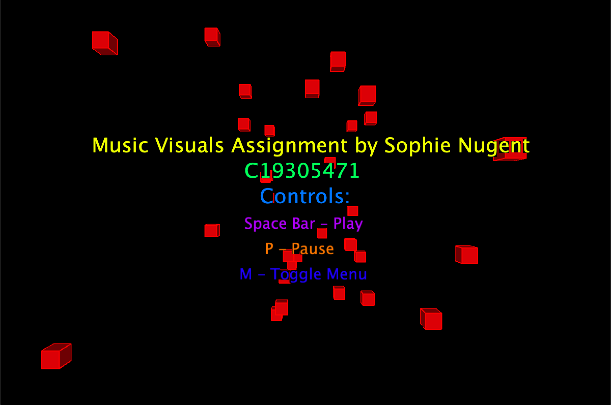

# Music Visualiser Project

Name: Sophie Nugent

Student Number: C19305471

# Description of the assignment

Well creating this was a journey to say the least. "Something beautiful to enjoy while listnening to music" was the introduction we got to this assignment and so that's what I created. After seeing the examples from the previous years, I may have gotten a bit ambitious. My initial plan was to do something intricate and complex and blow everyone away with my visuals. I had also planned to have multiple visuals. But alas, I stubbornly worked on a visual I ended up not keeping as my main visual. I decided to switch gears and focus on one aspect of my original idea and do it well so I could implement PVectors and proper Polymorphism. I have kept my previous idea in my examples folder as I still think it's interesting and even though I didn't get it fully working the way I wanted to, I feel I learnt a lot from tinkering around with it.


My final visual is fun and entertaining and I enjoyed implementing it. The cubes spawn in random x and y positions and float towards the user. They respond to the music and immerse you in it, closing in around you when its loud and fast paced, then shrinking away when it quietens and slows down.



# Instructions
Controls are as follows:

M - Toggle Menu
Space Bar - Play
P - Pause

# How it works
Most of the code that makes the cubes work is in the class Cubes. After everything is initialised, including the PVector which I used as alternatives to x,y and z. There is a maxZ and starting Z function which spawn in the cubes and sets the parameters. After setting up everything with SophieVisual2 class link, there are two functions that come into play in the Cubes class, update and render.

```Java
public class Cubes extends SophieVisual2
{
    //linking sv2 and initialising everything
    SophieVisual2 sv2;
    PVector location; //PVector for location in place of usual xyz
    float speed;
    float pz, px, py; //keeps consistent x, y, z
    float c = 0;//for the colours in fill further down
    //Z position of "spawn" and maximum Z position
    int startingZ = -1500;
    int maxZ = 1;
    
    //function for class
    public Cubes(SophieVisual2 sv2)
    {
        //sv2 in front of everything from other classes
        this.sv2 = sv2;      
       
        //location for random x,y,z values withing range to see them
        location = new PVector (sv2.random(-sv2.width/2, sv2.width/2),
        sv2.random(-sv2.height, sv2.height), sv2.random(startingZ, maxZ));
              
        pz = location.z;
        
    }

```

Render does the usual draw function stuff with colours, pulses sizing and everything sorted in it. I wanted the cubes to really react to the sound so they visually respond to the frequency bands, amplitude and are brightly coloured.

```Java
//render call to "draw" stuff
    public void render()
    {
        sv2.getAudioBuffer();

        sv2.lights();
        //stroke for cubes, lines
        sv2.stroke(PApplet.map(sv2.getSmoothedAmplitude(), 0, 1, 0, 255), 255, 255);
        sv2.strokeWeight(2);

        //keeping positions for x and y consistent 
        float px = PApplet.map(location.x/pz, 0, 1, 0, sv2.width/2);
        float py = PApplet.map(location.y/pz, 0, 1, 0, sv2.height);
        
        //push matrix :)
        sv2.pushMatrix();

        //translate 
        sv2.translate(px, py, pz);
        
        sv2.calculateFrequencyBands();
        float[] bands = sv2.getSmoothedBands();
        //colouring cubes rainbow with the amplitude affecting the size
        //and frequency bands affecting colouring
        for(int i = 0 ; i < bands.length; i ++)
        {
            c = (c + 0.1f) % 255;
            sv2.fill(c + bands[i], 255, 220);
            sv2.box(50+sv2.getSmoothedAmplitude()*500);
        }
        
        //PVectors are changed so this keeps consistency
        pz = location.z;
        px = location.x;
        py = location.y;
        //popmatrix :)
        sv2.popMatrix();

    }

```

The update establishes the speed in which the cubes move towards the camera and when the z value goes out of range the cubes spawn again at the beginning depth on the z axis. This was really a chance to get to know how these functions work and my favourite by far was my little bit of code to get the cubes to change through the colours and have the lines have their own colours dependent on amplitude. The changing values mean that the cubes get much smaller and spread out when the music is quieter and slower and then they bunch together and pulse at the chorus.

```Java
//update cube
    void update()
    {
        speed = sv2.getSmoothedAmplitude()*50;//speed for cubes moving towards camera
        location.z += speed;//changing z (depth)
        //respawning cubes when they go out of range
        if (location.z >= maxZ) {
            location.z = startingZ;
            location.x = sv2.random(-sv2.width/2, sv2.width/2);
            location.y = sv2.random(-sv2.height, sv2.height);
            
            pz = location.z;
          }
        
    }

```

The menu class is a simple play around to make a quick menu to talk through the controls.

```Java
	    public Menu (SophieVisual2 sv2)
    {
        this.sv2 = sv2;
    }

        public void render()
    {
        x = sv2.width/2 - 420;
        
        //main headings
        sv2.textSize(40);
        sv2.fill(45, 255, 255);
        sv2.text("Music Visuals Assignment by Sophie Nugent", x, 300);

        sv2.fill(100, 255, 255);
        sv2.text("C19305471", x + 300, 350);

        //music controls
        sv2.fill(150, 255, 255);
        sv2.text("Controls:", x + 330, 400);

        sv2.textSize(30);
        sv2.fill(200, 255, 255);
        sv2.text("Space Bar - Play", x + 300, 450);

        sv2.fill(20, 255, 255);
        sv2.text("P - Pause", x + 340, 500);

        sv2.fill(175, 255, 255);
        sv2.text("M - Toggle Menu", x + 290, 550);
    }
    
}
}
```

The VisualTest.java project was a bit of a failure as I didn’t get to implement the things I wanted to but I have included it because it served as a playground for trying things a different way. It was way more complicated than it needed to be but was a fun brain teaser at times. It is very self contained and there are a few missing tweaks but it was fun to learn with!


# What I am most proud of in the assignment

I loved figuring out how to make the cubes float towards the camera. It took more time than I would care to admit but I think it came out very smooth and how I wanted it to look. I enjoyed the playing around with changing through colours and creating variables that frequently changed.


I also loved the feel of it all, the way they closed in and bunched up with electric colour and then subdued and cleared was very satisfying.


And weirdly enough I'm proud I started again when I realised I wouldn't be able to divide up the original file I had been working on. I wanted to seperate my classes and properly use functions so I feel I learn that throughout this assignment. (However feel free to look at VisualTest.java (my messy playground) and VisualSickoMode.java (Almost the same but with an output that made me laugh :) )).


# Youtube Video

[](https://youtu.be/6ZPJ8wNZJHI)

Enjoy!

